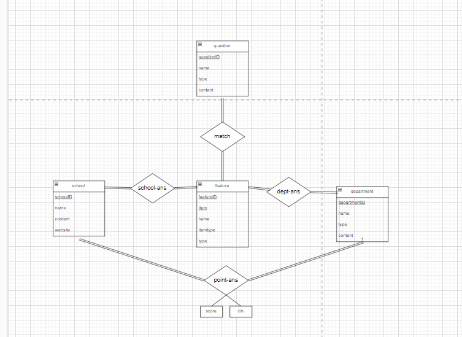
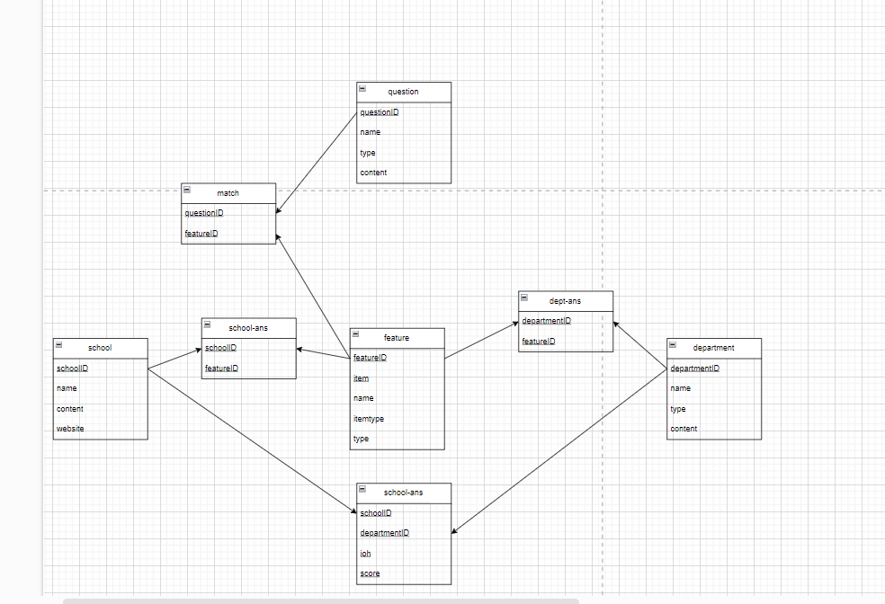

# DB

## HW
### HW01: [ERD and CRUD introduction with mysql](https://youtu.be/vVKSFbrTI6M)

### (HW04)HW01extra: [schema diagram](https://youtu.be/3HQAaHCplTg)

### HW02: [CRUD in web with mysql](https://youtu.be/HG85ye_FHOY)
### (HW04)HW02extra: [achieve search function](https://youtu.be/fqBurUgfSWA)
### HW03: [CRUD in mongoDB](https://youtu.be/uVBjpWffbcM)
### (HW04)HW03extra: [CRUD in web with mongondb](https://youtu.be/hn0c5aV3yk4)
### HW04: 會對HW01-HW03增加內容,成為extra系列
### HW05: [Azure development](https://youtu.be/wsZ7iXCsSdE)
